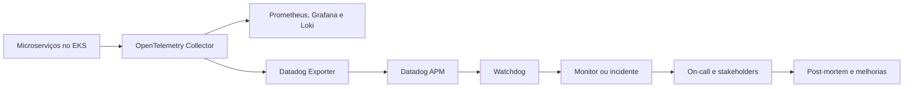
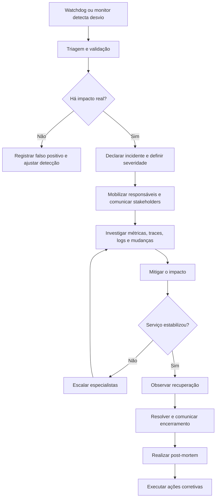

# Gestão Preditiva da SolidaryTech

## Objetivo

A gestão preditiva da SolidaryTech usa telemetria de aplicações e
infraestrutura para identificar comportamentos anormais antes que eles se
transformem em indisponibilidade relevante. A solução combina:

- OpenTelemetry para instrumentação e transporte padronizado;
- Prometheus, Grafana e Loki para observabilidade local;
- Datadog APM para correlação de métricas, traces e logs;
- Datadog Watchdog para detecção automática de anomalias e outliers;
- Datadog Incident Management para coordenar resposta, comunicação e
  aprendizado pós-incidente.

O Watchdog constrói baselines do comportamento esperado dos serviços. Ele
compara requisições, erros e latência atuais com esses baselines e destaca
desvios relevantes sem depender exclusivamente de limites estáticos.

## Arquitetura



Os microserviços enviam métricas, traces e logs ao Collector pelo protocolo
OTLP. O Collector mantém os destinos locais e, quando a integração estiver
habilitada, envia os mesmos sinais ao Datadog. O `datadog/connector` deriva
métricas APM dos traces, enquanto o `datadog/exporter` transmite os três tipos
de sinal.

## Ativação

A integração é opcional e permanece desabilitada por padrão:

```hcl
enable_datadog = false
datadog_site   = "datadoghq.com"
```

Para habilitá-la, altere a flag:

```hcl
enable_datadog = true
```

Informe a API key somente por variável de ambiente. Ela não deve ser gravada
no `terraform.tfvars`, em manifests ou no Git:

```powershell
$env:TF_VAR_datadog_api_key="SUA_API_KEY"
terraform plan
terraform apply
```

O Terraform cria o Secret `datadog-credentials` no namespace `monitoring`. O
OpenTelemetry Collector recebe a chave por `secretKeyRef`. Se a flag estiver
habilitada sem uma chave válida, uma precondição interrompe o plano.

O site deve corresponder à região da organização Datadog. Exemplos:

| Região | Valor |
|---|---|
| US1 | `datadoghq.com` |
| EU | `datadoghq.eu` |
| US3 | `us3.datadoghq.com` |
| US5 | `us5.datadoghq.com` |

## Identidade e correlação dos serviços

Os Deployments usam Unified Service Tagging:

```yaml
tags.datadoghq.com/env: fiap-lab5
tags.datadoghq.com/service: donation-service
tags.datadoghq.com/version: "1.0.0"
```

Os atributos OpenTelemetry equivalentes identificam ambiente, versão e
namespace lógico:

```text
deployment.environment.name=fiap-lab5
service.version=1.0.0
service.namespace=solidarytech
```

Esse padrão permite relacionar uma anomalia a um serviço, versão e ambiente,
reduzindo ambiguidades durante a investigação. Toda nova versão deve atualizar
o atributo `service.version` e a label `tags.datadoghq.com/version`.

## Sinais preditivos

O Watchdog deve observar principalmente os sinais RED:

- **Rate:** volume de requisições e mudanças inesperadas de tráfego;
- **Errors:** proporção de erros HTTP, exceções e falhas de dependências;
- **Duration:** latência p50, p95 e p99.

Também devem ser acompanhados:

- reinicializações, indisponibilidade e saturação dos Pods;
- consumo de CPU e memória;
- backlog, idade e falhas de processamento da SQS;
- throttling, latência e erros do DynamoDB;
- conexões, latência e erros do PostgreSQL;
- alterações de versão próximas ao início de uma anomalia.

O Watchdog produz dois resultados importantes:

- **Anomalias:** desvios em relação ao comportamento esperado;
- **Outliers:** tags, versões, endpoints ou grupos que contribuem
  desproporcionalmente para erros ou latência.

Os achados automáticos não substituem monitores determinísticos. Disponibilidade
total, perda de dados, esgotamento de filas e violações de SLO devem continuar
protegidos por monitores explícitos.

## Fluxo de gestão de incidentes



### Estados

1. **Detectado:** o Watchdog ou um monitor identifica o desvio.
2. **Em triagem:** o on-call confirma escopo, impacto e duplicidade.
3. **Declarado:** um incidente recebe severidade, comandante e responsáveis.
4. **Em investigação:** evidências são reunidas e hipóteses são testadas.
5. **Em mitigação:** uma ação reduz ou remove o impacto.
6. **Em observação:** métricas e experiência do usuário são acompanhadas.
7. **Resolvido:** o serviço está estável e os stakeholders são informados.
8. **Em post-mortem:** causa, resposta e oportunidades são documentadas.
9. **Encerrado:** ações corretivas possuem responsável e prazo.

## Severidades e objetivos

| Nível | Critério | Reconhecimento | Comunicação |
|---|---|---:|---:|
| SEV-1 | Doações indisponíveis, perda de dados ou indisponibilidade ampla | 5 min | A cada 15 min |
| SEV-2 | Serviço crítico degradado ou indisponível sem perda de dados | 15 min | A cada 30 min |
| SEV-3 | Impacto parcial com alternativa operacional | 4 h | Em mudanças relevantes |
| SEV-4 | Anomalia sem impacto atual | Próximo dia útil | Registro interno |

## Papéis

- **On-call:** recebe o alerta, valida o impacto e inicia a triagem;
- **Incident Commander:** coordena decisões, prioridades e escalonamentos;
- **Tech Lead:** lidera diagnóstico e mitigação técnica;
- **Communication Lead:** atualiza stakeholders sem interromper investigadores;
- **Service Owner:** aprova encerramento e acompanha ações corretivas;
- **Scribe:** mantém a linha do tempo, decisões e evidências.

Uma mesma pessoa pode acumular papéis em incidentes menores, mas o Incident
Commander deve continuar responsável pela coordenação.

## Comunicação

Toda atualização de SEV-1 e SEV-2 deve informar:

1. impacto observado;
2. serviços ou usuários afetados;
3. horário de início conhecido;
4. estado atual da investigação;
5. mitigação aplicada ou em preparação;
6. horário da próxima atualização.

Exemplo de abertura:

> SEV-2 em investigação: o donation-service apresenta aumento anormal de
> latência e erros desde 14:20 BRT. O recebimento de doações está degradado.
> A equipe investiga traces e dependências. Próxima atualização às 14:50 BRT.

Exemplo de encerramento:

> Incidente resolvido às 15:05 BRT. A taxa de erros e a latência retornaram ao
> baseline e permanecem estáveis. O post-mortem será concluído em até cinco
> dias úteis.

## Runbooks

Cada monitor acionável deve possuir uma URL de runbook. Um runbook deve conter:

- descrição e impacto provável;
- dashboards, queries e traces iniciais;
- verificações de saúde;
- ações de mitigação seguras;
- critérios de escalonamento;
- forma de validar a recuperação;
- procedimento de rollback;
- responsável pelo serviço.

Runbooks mínimos recomendados:

- alta taxa de erros;
- latência anormal;
- Pod em `CrashLoopBackOff`;
- backlog da SQS;
- DynamoDB com throttling;
- PostgreSQL indisponível;
- OpenTelemetry Collector sem exportar dados.

## Post-mortem

Incidentes SEV-1 e SEV-2 exigem post-mortem sem culpabilização em até cinco
dias úteis. O documento deve registrar:

- resumo executivo e impacto;
- linha do tempo com detecção, resposta, mitigação e resolução;
- causa raiz e fatores contribuintes;
- por que os mecanismos existentes não evitaram o impacto;
- o que funcionou e o que dificultou a resposta;
- ações corretivas preventivas e de detecção;
- responsável, prioridade e prazo de cada ação.

As ações podem alterar código, arquitetura, capacidade, SLOs, monitores,
instrumentação, dashboards e runbooks. O incidente só é operacionalmente
encerrado quando todas as ações estiverem registradas e priorizadas.

## Indicadores de evolução

A efetividade do processo deve ser revisada periodicamente por:

- MTTD: tempo médio até a detecção;
- MTTA: tempo médio até o reconhecimento;
- MTTR: tempo médio até a recuperação;
- quantidade de incidentes por severidade;
- reincidência da mesma causa;
- proporção de falsos positivos;
- percentual de alertas com runbook;
- percentual de ações corretivas concluídas no prazo.

O objetivo não é maximizar a quantidade de alertas. É detectar rapidamente
mudanças relevantes, reduzir impacto e transformar cada incidente em melhoria
mensurável do sistema.
