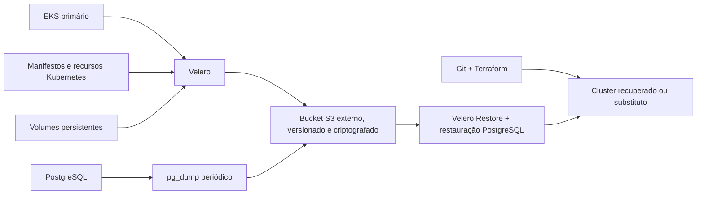

# Plano de Continuidade de Negócios (PCN) — SolidaryTech

## 1. Controle do documento

| Item | Definição |
|---|---|
| Organização | SolidaryTech |
| Ambiente | `fiap-lab5` |
| Serviço mais crítico | `donation-service` |
| Região primária | AWS `us-east-1` |
| Plataforma | Amazon EKS e Kubernetes |
| Responsável pelo PCN | Responsável técnico da SolidaryTech |
| Periodicidade de revisão | Trimestral e após incidentes SEV-1 ou SEV-2 |
| Versão | 1.0 |
| Data | 28/07/2026 |

## 2. Objetivo

Este Plano de Continuidade de Negócios define como a SolidaryTech deve
responder e recuperar seus serviços diante da indisponibilidade do cluster
Kubernetes, perda de recursos, corrupção de dados ou falha grave da região
primária.

Os objetivos do plano são:

- preservar os registros de doações;
- restabelecer primeiro o fluxo crítico de doações;
- limitar o tempo de indisponibilidade e a perda de dados;
- definir responsáveis, decisões e canais de comunicação;
- manter backups independentes do cluster principal;
- comprovar periodicamente que os backups podem ser restaurados;
- registrar aprendizados e ações preventivas após cada acionamento.

## 3. Escopo

O PCN abrange:

- cluster Amazon EKS;
- objetos Kubernetes e configurações de implantação;
- `donation-service`, `ngo-service` e `volunteer-service`;
- PostgreSQL dos serviços de doações e ONGs;
- tabela DynamoDB de voluntários;
- fila Amazon SQS usada pelo fluxo de doações;
- Ingress e exposição das APIs;
- Argo CD e repositório Git como fonte declarativa;
- Prometheus, Grafana, Loki, OpenTelemetry e Datadog;
- Terraform e estado da infraestrutura;
- imagens dos microsserviços armazenadas no Amazon ECR.

Não fazem parte deste plano falhas individuais de estação de trabalho ou
indisponibilidades sem impacto nos serviços da plataforma. Esses eventos devem
seguir o processo operacional normal.

## 4. Contexto e dependências

A SolidaryTech executa três microsserviços no EKS:

| Serviço | Função | Persistência | Criticidade |
|---|---|---|---|
| `donation-service` | Registrar doações e publicar eventos | PostgreSQL e SQS | Crítica |
| `ngo-service` | Gerenciar ONGs | PostgreSQL | Alta |
| `volunteer-service` | Gerenciar voluntários | DynamoDB | Média |

O `donation-service` é o hot path da plataforma. Sua recuperação tem prioridade
sobre componentes administrativos e de observabilidade.

As principais dependências externas são AWS, GitHub, Datadog, DNS, credenciais
temporárias do AWS Academy e conectividade com a Internet.

## 5. Análise de Impacto no Negócio (BIA)

| Processo | Impacto da indisponibilidade | Prioridade |
|---|---|---:|
| Registro de doações | Impede novas doações e pode causar perda financeira e reputacional | 1 |
| Persistência das doações | Risco de perda, duplicidade ou inconsistência de registros | 1 |
| Cadastro e consulta de ONGs | Prejudica a operação e a vinculação das doações | 2 |
| Cadastro de voluntários | Interrompe novas inscrições, sem afetar doações existentes | 3 |
| Observabilidade | Reduz a capacidade de detectar e diagnosticar falhas | 3 |

Após 30 minutos de indisponibilidade do fluxo de doações, a equipe deve tratar o
evento como impacto significativo. Perda confirmada ou corrupção de dados de
doações caracteriza incidente SEV-1.

## 6. RTO e RPO

### 6.1 Definições

- **RTO (Recovery Time Objective):** tempo máximo aceitável entre a declaração
  do desastre e o restabelecimento do serviço.
- **RPO (Recovery Point Objective):** intervalo máximo de dados que pode ser
  perdido, medido entre o desastre e o último ponto recuperável.

### 6.2 Objetivos definidos

| Componente | RTO | RPO | Justificativa |
|---|---:|---:|---|
| Dados de doações no PostgreSQL | 1 hora | 15 minutos | Dados financeiros e reputacionais críticos |
| API `donation-service` | 2 horas | 15 minutos | Hot path da plataforma |
| Dados e API de ONGs | 4 horas | 1 hora | Necessários para a operação, mas não prioritários durante o desastre |
| Dados e API de voluntários | 4 horas | 1 hora | Impacto operacional moderado |
| SQS de eventos de doação | 2 horas | 15 minutos | Evitar perda ou reprocessamento incorreto de eventos |
| Observabilidade | 8 horas | 24 horas | Pode ser restabelecida depois dos serviços de negócio |

O RPO de 15 minutos para doações somente é considerado atendido quando houver
backup ou replicação executada, validada e armazenada fora do cluster a cada
15 minutos. A simples existência de manifestos no Git não protege os dados do
PostgreSQL.

## 7. Estratégia de continuidade e Disaster Recovery

A estratégia recomendada para este ambiente é a **Opção A — backup externo com
Velero**, complementada por backup lógico do PostgreSQL.

### 7.1 Proteções requeridas

- bucket S3 dedicado a DR, com criptografia, versionamento e bloqueio de acesso
  público;
- retenção e política de ciclo de vida dos backups;
- backup Velero dos namespaces críticos e volumes persistentes;
- `pg_dump` do banco `donation_db` a cada 15 minutos;
- backup do banco `ngo_db` a cada hora;
- exportação ou recuperação independente da tabela DynamoDB;
- política explícita para mensagens pendentes na SQS;
- estado do Terraform armazenado e protegido;
- imagens disponíveis no ECR ou reconstruíveis pelo pipeline;
- credenciais de restauração protegidas e acessíveis em uma emergência.

### 7.2 Retenção sugerida

| Tipo | Frequência | Retenção |
|---|---:|---:|
| Backup das doações | 15 minutos | 48 horas |
| Backup diário consolidado | Diária | 30 dias |
| Backup semanal | Semanal | 12 semanas |
| Backup mensal | Mensal | 12 meses |

## 8. Situações de acionamento

O PCN pode ser acionado quando ocorrer:

- indisponibilidade total do EKS sem previsão de recuperação dentro do RTO;
- exclusão ou corrupção do namespace `fiap-microservices`;
- perda ou corrupção do volume PostgreSQL;
- indisponibilidade regional prolongada;
- ataque ou erro operacional com destruição de recursos;
- comprometimento de credenciais com risco aos dados;
- falha de restauração local que exija reconstrução do ambiente.

O Incident Commander declara formalmente o desastre após validar o impacto com
o responsável técnico. Se os dados de doações estiverem em risco, a severidade
inicial deve ser SEV-1.

## 9. Papéis e responsabilidades

| Papel | Responsabilidade |
|---|---|
| Incident Commander | Declarar o desastre, definir prioridades e coordenar a resposta |
| Líder técnico | Reconstruir infraestrutura, restaurar dados e validar dependências |
| Responsável por dados | Selecionar o ponto de recuperação e validar integridade |
| Communication Lead | Atualizar liderança, usuários e demais stakeholders |
| Scribe | Registrar horários, decisões, evidências e resultados |
| Service Owner | Aprovar o retorno à operação e acompanhar ações corretivas |

Em equipes pequenas, uma pessoa pode exercer mais de um papel, mas as decisões
e validações devem permanecer registradas.

## 10. Procedimento de resposta e recuperação

### Fase 1 — Detecção e declaração

1. Receber alerta do Datadog, Kubernetes, AWS ou relato de usuário.
2. Confirmar o impacto nos endpoints e na persistência.
3. Abrir incidente, classificar a severidade e iniciar a timeline.
4. Identificar o último backup bem-sucedido.
5. Estimar se a recuperação local cabe no RTO.
6. Se não couber, declarar desastre e acionar este PCN.

### Fase 2 — Contenção

1. Bloquear mudanças e implantações não relacionadas.
2. Preservar logs, eventos, estado e evidências.
3. Interromper gravações caso exista risco de corrupção adicional.
4. Revogar credenciais comprometidas, quando aplicável.
5. Informar aos stakeholders o impacto e a próxima atualização.

### Fase 3 — Reconstrução

1. Validar credenciais AWS e acesso ao backend do Terraform.
2. Provisionar ou recuperar rede, EKS, nós e recursos gerenciados.
3. Instalar componentes básicos: Ingress, Argo CD, Velero e observabilidade
   mínima.
4. Verificar disponibilidade das imagens no ECR.
5. Confirmar acesso ao bucket de backup externo.

### Fase 4 — Restauração

1. Selecionar o ponto de recuperação compatível com o RPO.
2. Restaurar namespaces, Secrets, ConfigMaps, Services, Deployments, PVCs e
   demais objetos por meio do Velero.
3. Restaurar o PostgreSQL usando o backup lógico validado.
4. Reconciliar os manifestos no Argo CD.
5. Validar DynamoDB e mensagens pendentes da SQS.
6. Manter o Ingress fechado ao público até a validação técnica.

### Fase 5 — Validação

1. Verificar que todos os Pods críticos estão `Running` e `Ready`.
2. Executar health checks dos três microsserviços.
3. Consultar ONGs, doações e voluntários restaurados.
4. Criar uma doação controlada e confirmar:
   - resposta HTTP esperada;
   - gravação única no PostgreSQL;
   - publicação do evento na SQS;
   - ausência de erros nos logs;
   - emissão das métricas.
5. Comparar quantidade e integridade dos registros com o backup.
6. Liberar o Ingress e observar o ambiente por pelo menos 15 minutos.

### Fase 6 — Retorno à operação

1. Obter aprovação do Service Owner.
2. Comunicar a restauração do serviço.
3. Manter monitoramento intensificado por 24 horas.
4. Encerrar o incidente somente após confirmar estabilidade e consistência.

## 11. Comunicação

Toda comunicação deve informar:

- o que aconteceu;
- serviços e usuários afetados;
- horário conhecido de início;
- risco ou confirmação de perda de dados;
- ações em execução;
- previsão ou objetivo de recuperação;
- horário da próxima atualização.

### Frequência

| Severidade | Frequência mínima |
|---|---:|
| SEV-1 | A cada 15 minutos |
| SEV-2 | A cada 30 minutos |
| SEV-3 | A cada mudança relevante |

### Mensagem de abertura

> A SolidaryTech identificou uma indisponibilidade no ambiente principal que
> afeta o processamento de doações. O Plano de Continuidade de Negócios foi
> acionado e a equipe está restaurando o ambiente a partir do último ponto
> recuperável. A próxima atualização será publicada em 15 minutos.

### Mensagem de recuperação

> O processamento de doações foi restabelecido e permanece sob observação. A
> integridade dos dados foi validada a partir do ponto de recuperação
> selecionado. O impacto consolidado e as ações preventivas serão apresentados
> no Post-Mortem.

## 12. Testes e evidências

O PCN deve ser exercitado pelo menos trimestralmente e após mudanças
significativas na infraestrutura ou persistência.

Cada exercício deve registrar:

- identificação e horário do backup;
- status `Completed` do Velero;
- objetos e volumes incluídos;
- ponto de recuperação do PostgreSQL;
- horário de início e fim do restore;
- RTO medido;
- RPO observado;
- validação funcional dos endpoints;
- quantidade de registros antes e depois;
- falhas encontradas e ações corretivas;
- capturas de tela ou saídas de comandos.

Um backup só é considerado válido depois de um teste de restauração
bem-sucedido. O sucesso da criação do backup, isoladamente, não comprova a
capacidade de recuperação.

## 13. Critérios de sucesso

O exercício ou acionamento será bem-sucedido quando:

- o `donation-service` estiver acessível dentro do RTO;
- o ponto restaurado respeitar o RPO declarado;
- os dados não apresentarem corrupção ou duplicação causada pelo restore;
- uma nova doação puder ser concluída ponta a ponta;
- a equipe registrar a timeline e comunicar os stakeholders;
- todas as exceções e pendências tiverem responsáveis e prazos.

## 14. Post-Mortem e melhoria contínua

Todo desastre real e todo teste com falha deve gerar Post-Mortem sem
culpabilização em até cinco dias úteis, contendo:

- resumo executivo;
- impacto e duração;
- linha do tempo;
- causa raiz e fatores contribuintes;
- RTO e RPO planejados versus realizados;
- eficácia dos backups, alertas e runbooks;
- decisões tomadas durante a recuperação;
- ações corretivas com responsável, prioridade e prazo.

Os resultados devem atualizar este PCN, os runbooks, o Terraform, os monitores
e a estratégia de backup quando necessário.

## 15. Riscos, limitações e pendências

Este documento estabelece objetivos e procedimentos, mas eles só podem ser
declarados como comprovados após a implementação e o teste da estratégia.

Riscos atuais:

- credenciais do AWS Academy são temporárias e podem expirar durante o restore;
- limitações de IAM podem impedir a criação de roles específicas para Velero;
- um bucket na mesma conta ou região não protege contra todos os cenários;
- manifesto no Git não substitui backup de dados;
- backup de PVC sem consistência da aplicação pode produzir banco inválido;
- restore da SQS pode exigir estratégia de idempotência e reconciliação;
- custos e limites do laboratório podem impedir um ambiente warm standby.

Pendências para tornar o PCN comprovável:

1. criar e proteger o bucket externo de backup;
2. instalar e configurar o Velero;
3. implementar backup lógico periódico do PostgreSQL;
4. definir proteção para DynamoDB e SQS;
5. documentar as credenciais de emergência sem registrá-las no Git;
6. executar um restore controlado;
7. medir e registrar o RTO e o RPO efetivamente alcançados.

## 16. Aprovação

| Papel | Nome | Data | Aprovação |
|---|---|---|---|
| Responsável técnico | A definir | A definir | Pendente |
| Service Owner | A definir | A definir | Pendente |
| Responsável pelo negócio | A definir | A definir | Pendente |

